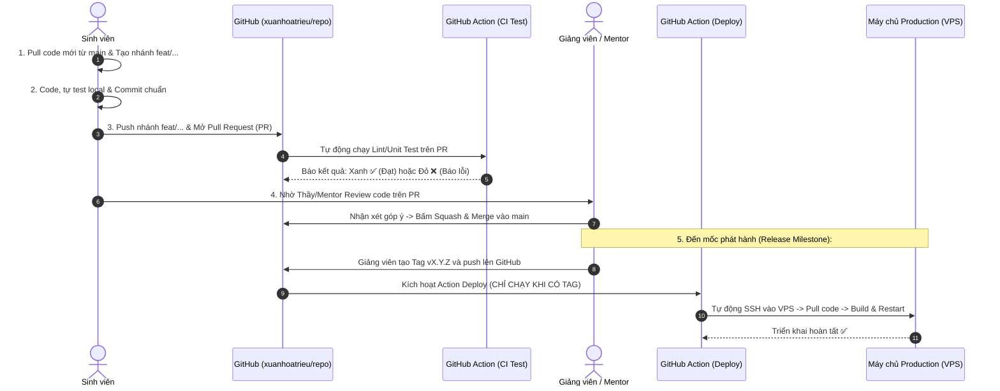

# Hướng Dẫn Toàn Diện: Quy Trình Git Team & Tự Động Hóa Deploy Production (CI/CD)
> **Tài liệu chuẩn hóa dành cho Giảng viên (Mentor) và Sinh viên tham gia dự án thực tế**  
> Quản trị hệ thống: `github.com/xuanhoatrieu`  
> Phiên bản: `2.0.0`

---

## MỤC LỤC
1. [Tổng Quan & Phân Định Vai Trò (Mentor vs Sinh Viên)](#1-tổng-quan--phân-định-vai-trò)
2. [Quy Chuẩn Phân Nhánh & Commit (Conventional Commits)](#2-quy-chuẩn-phân-nhánh--commit)
3. [Quy Trình 5 Bước Làm Việc Của Team (Step-by-Step)](#3-quy-trình-5-bước-làm-việc-của-team)
4. [Cài Đặt Hàng Rào Bảo Vệ (Branch Protection Rules)](#4-cài-đặt-hàng-rào-bảo-vệ)
5. [Tự Động Hóa Triển Khai Lên VPS Qua GitHub Actions (Cách 2)](#5-tự-động-hóa-triển-khai-lên-vps-qua-github-actions)
6. [Cơ Chế "Cứu Hỏa" (Rollback) Trong 30 Giây](#6-cơ-chế-cứu-hỏa-rollback-trong-30-giây)
7. [Xử Lý Các Sự Cố Thường Gặp (Troubleshooting)](#7-xử-lý-các-sự-cố-thường-gặp)
8. [Bảng Tra Cứu Nhanh 1 Trang Cho Sinh Viên (Cheat-Sheet)](#8-bảng-tra-cứu-nhanh-cho-sinh-viên)

---

## 1. Tổng Quan & Phân Định Vai Trò

Hệ thống được thiết kế theo 2 nguyên tắc vàng:
1. **Chuẩn doanh nghiệp**: Sinh viên thực hành đúng tác phong công ty công nghệ (Pull Request, Code Review, SemVer, CI/CD).
2. **An toàn tuyệt đối**: Nhánh `main` được bảo vệ 100%. Sinh viên dù thao tác sai cũng không làm hỏng mã nguồn chính hay làm gián đoạn Production.

```
                            ┌────────────────────────────────────────┐
                            │      GIẢNG VIÊN / TECH LEAD            │
                            │      Role: Owner / Reviewer            │
                            │      - Khóa bảo vệ nhánh `main`        │
                            │      - Đánh giá & Duyệt Pull Request   │
                            │      - Gắn Tag phiên bản phát hành     │
                            └───────────────────┬────────────────────┘
                                                │ Phê duyệt & Merge
                                                ▼
┌────────────────────────────────────────────────────────────────────────────────────┐
│ Nhánh Chính: `main` (Protected) - Không ai được push trực tiếp                      │
└───────────────────────────────────────────────────▲────────────────────────────────┘
                                                    │ Mở Pull Request
                                                    │
                            ┌───────────────────────┴────────────────┐
                            │    SINH VIÊN (Developer / Team)        │
                            │    Role: Contributor                   │
                            │    - Tạo nhánh: `feat/...`, `fix/...`  │
                            │    - Viết code & commit chuẩn          │
                            │    - Mở PR và lắng nghe góp ý          │
                            └────────────────────────────────────────┘
```

| Vai trò | Trách nhiệm chính | Quyền hạn trên GitHub |
| :--- | :--- | :--- |
| **Giảng viên / Mentor** | Quản trị dự án, Code Reviewer, Release Manager | - Toàn quyền cấu hình bảo vệ nhánh `main`.<br>- Duyệt (Approve) và gộp (Merge) Pull Request.<br>- Tạo Tag phiên bản (`vX.Y.Z`) để kích hoạt deploy. |
| **Sinh viên** | Lập trình viên (Developer) | - Chỉ làm việc trên nhánh phụ (`feat/...`, `fix/...`).<br>- Mở Pull Request để nộp bài.<br>- Tuyệt đối **không được push trực tiếp** vào `main`. |

---

## 2. Quy Chuẩn Phân Nhánh & Commit

### 2.1. Quy tắc đặt tên nhánh (Branch Naming)
Cú pháp bắt buộc: `<tiền-tố>/<tên-hoặc-masv>-<tên-task>`

* **`feat/`** (Tính năng mới): `feat/hoa-login-page`, `feat/nam-api-cart`
* **`fix/`** (Sửa lỗi): `fix/tuan-cors-issue`, `fix/hoa-null-pointer`
* **`refactor/`** (Tái cấu trúc code): `refactor/nam-clean-service`
* **`docs/`** (Cập nhật tài liệu): `docs/hoa-readme-setup`

### 2.2. Quy tắc viết commit (Conventional Commits)
Không commit các câu vô nghĩa như: *"update"*, *"fix bug"*, *"abc"*. Sử dụng cú pháp:

* `feat: implement user login with JWT authentication`
* `fix: handle edge case when email is empty`
* `style: reformat code according to linter`
* `test: add unit tests for calculateCartTotal`
* `docs: update deployment instructions in README`

---

## 3. Quy Trình 5 Bước Làm Việc Của Team



### Bước 1: Sinh viên cập nhật code và tạo nhánh mới
```bash
# 1. Luôn chuyển về main và kéo code mới nhất về
git checkout main
git pull origin main

# 2. Tạo nhánh riêng của mình
git checkout -b feat/hoa-login-page
```

### Bước 2: Viết code, kiểm tra và commit
```bash
# Kiểm tra các file đã thay đổi
git status

# Thêm file vào vùng staging
git add <tên-file-hoặc-thư-mục>

# Commit với thông điệp rõ ràng
git commit -m "feat: design responsive login form with validation"
```

### Bước 3: Đẩy nhánh lên GitHub & Mở Pull Request (PR)
```bash
git push -u origin feat/hoa-login-page
```
* Sinh viên truy cập `https://github.com/xuanhoatrieu/<tên-repo>`
* Bấm **Compare & pull request**, điền đầy đủ mô tả: đã làm gì, đã test những gì, đính kèm ảnh chụp kết quả.

### Bước 4: Kiểm tra tự động (CI) & Giảng viên duyệt PR
* **GitHub Actions** tự động chạy kiểm tra cú pháp và unit tests.
* Giảng viên vào tab **Files changed** để review từng dòng code:
  * Góp ý chỗ chưa tối ưu để sinh viên chỉnh sửa.
  * Khi đạt yêu cầu: Giảng viên bấm **Approve** và chọn **Squash and merge**.

### Bước 5: Giảng viên phát hành phiên bản (Tag Release)
Khi hoàn thành một đợt bài tập hoặc tính năng quan trọng:
```bash
# Giảng viên kéo nhánh main đã merge đầy đủ về máy
git checkout main
git pull origin main

# Tạo tag phiên bản theo chuẩn SemVer
git tag -a v1.0.0 -m "Release v1.0.0: Hoàn thành module Authentication"

# ĐẨY DUY NHẤT TAG NÀY LÊN GITHUB (Không dùng git push --tags)
git push origin v1.0.0
```

---

## 4. Cài Đặt Hàng Rào Bảo Vệ (Branch Protection Rules)

Giảng viên cấu hình 1 lần duy nhất cho mỗi repo tại:  
`https://github.com/xuanhoatrieu/<tên-repo>` ➔ **Settings** ➔ **Branches** ➔ **Add branch protection rule**:

1. **Branch name pattern**: Điền `main`.
2. Tích chọn các mục sau:
   - ✅ **Require a pull request before merging**:
     - *Require approvals*: Đặt `1`.
     - *Dismiss stale pull request approvals when new commits are pushed*.
   - ✅ **Require status checks to pass before merging** (chọn job kiểm tra CI).
   - ✅ **Require conversation resolution before merging** (bắt buộc phản hồi hết comment mới được merge).
   - ✅ **Do not allow bypassing the above settings** (chặn hoàn toàn push đè trực tiếp).
3. Bấm **Save changes**.

---

## 5. Tự Động Hóa Triển Khai Lên VPS Qua GitHub Actions

Phương pháp này giúp VPS Production **tự động cập nhật bản mới ngay khi Giảng viên đẩy Tag**, hoàn toàn không cần can thiệp thủ công.

### BƯỚC 5.1: Chuẩn bị trên máy chủ VPS (Làm 1 lần)
1. **Đăng nhập vào VPS qua SSH**:
   ```bash
   ssh root@ip_vps_cua_anh
   ```
2. **Tạo SSH Key riêng cho GitHub Actions**:
   ```bash
   ssh-keygen -t ed25519 -C "github-actions-deploy" -f ~/.ssh/github_actions -N ""
   ```
3. **Cấp quyền cho key này đăng nhập vào VPS**:
   ```bash
   cat ~/.ssh/github_actions.pub >> ~/.ssh/authorized_keys
   chmod 600 ~/.ssh/authorized_keys
   ```
4. **Xem và copy Private Key** (Sao chép toàn bộ từ `-----BEGIN...` đến `-----END...`):
   ```bash
   cat ~/.ssh/github_actions
   ```
5. **Khởi tạo sẵn thư mục dự án trên VPS**:
   ```bash
   mkdir -p /var/www/my-project
   cd /var/www/my-project
   git clone https://github.com/xuanhoatrieu/<tên-repo>.git .
   
   # Tạo file .env production tại đây (tuyệt đối không đưa file .env lên GitHub)
   nano .env
   ```

---

### BƯỚC 5.2: Cấu hình GitHub Secrets
Truy cập: `https://github.com/xuanhoatrieu/<tên-repo>` ➔ **Settings** ➔ **Secrets and variables** ➔ **Actions** ➔ Bấm **New repository secret**:

| Tên Secret (Name) | Giá trị (Secret Value) |
| :--- | :--- |
| `SSH_HOST` | Địa chỉ IP của VPS (ví dụ: `103.77.x.x` hoặc domain `api.domain.com`) |
| `SSH_USER` | Tên user đăng nhập (ví dụ: `root` hoặc `ubuntu`) |
| `SSH_KEY` | Toàn bộ nội dung Private Key copy từ Bước 5.1 |
| `SSH_PORT` | Cổng SSH của VPS (mặc định là `22`) |

---

### BƯỚC 5.3: Tạo File Workflow Tự Động Deploy
Tạo file `.github/workflows/deploy.yml` trong mã nguồn dự án:

```yaml
name: Production Auto Deploy

on:
  push:
    tags:
      - 'v*'   # CHỈ KÍCH HOẠT KHI PUSH TAG (VD: v1.0.0) - KHÔNG LẮNG NGHE MAIN

jobs:
  deploy:
    name: Deploy to VPS
    runs-on: ubuntu-latest
    steps:
      - name: SSH vào VPS và triển khai bản mới
        uses: appleboy/ssh-action@v1.0.3
        with:
          host: ${{ secrets.SSH_HOST }}
          username: ${{ secrets.SSH_USER }}
          key: ${{ secrets.SSH_KEY }}
          port: ${{ secrets.SSH_PORT }}
          script: |
            set -e
            echo "🚀 [Deploy] Bắt đầu triển khai phiên bản: ${{ github.ref_name }}"
            
            # 1. Đi tới thư mục dự án trên VPS
            cd /var/www/my-project
            
            # 2. Kéo toàn bộ tag mới nhất về
            git fetch --tags
            
            # 3. Chuyển sang đúng tag vừa release
            git checkout ${{ github.ref_name }}
            
            # 4. Khởi động lại ứng dụng:
            # (Trường hợp 1: Dùng Docker Compose - Khuyên dùng)
            docker compose down
            docker compose up -d --build
            
            # (Trường hợp 2: Dùng Node.js / PM2)
            # npm install --production
            # npm run build
            # pm2 restart all
            
            echo "✅ [Deploy] Phiên bản ${{ github.ref_name }} đã chạy thành công trên Production!"
```

---

### BƯỚC 5.4: Kích hoạt & Kiểm tra thực tế
Dưới máy local của Giảng viên:
```bash
# Tạo tag thử nghiệm
git tag -a v0.1.0 -m "Release v0.1.0: Test auto deploy"

# Đẩy tag lên GitHub
git push origin v0.1.0
```
* Mở tab **Actions** trên GitHub: Xem tiến trình SSH vào VPS, pull code bản `v0.1.0` và build/restart service.
* Sau 1-2 phút, truy cập website/API trên Production để nghiệm thu bản mới!

---

## 6. Cơ Chế "Cứu Hỏa" (Rollback) Trong 30 Giây

Nếu phiên bản `v1.2.0` vừa release gặp lỗi nghiêm trọng trên Production, việc khôi phục về bản cũ `v1.1.0` diễn ra trong tích tắc:

```bash
# 1. SSH vào VPS
ssh root@ip_vps

# 2. Đi tới thư mục dự án và chuyển về tag ổn định trước đó
cd /var/www/my-project
git checkout v1.1.0

# 3. Khởi động lại ứng dụng
docker compose down && docker compose up -d --build
```
> **Lợi ích to lớn của Tag:** Tag là mốc bất biến (snapshot). Không cần phải mò commit SHA hay revert code gây rối lịch sử git.

---

## 7. Xử Lý Các Sự Cố Thường Gặp

### Tình huống 1: Lỡ viết code trực tiếp trên `main` ở máy cá nhân (chưa commit)
```bash
# Đổi sang nhánh mới, mang toàn bộ code đang viết dở theo:
git checkout -b feat/ten-task-cua-ban
# Giờ đây có thể add và commit an toàn trên nhánh mới
```

### Tình huống 2: Xung đột code (Merge Conflict) khi mở PR
Xảy ra khi nhánh `main` đã có người khác cập nhật trước:
```bash
# Chuyển về nhánh tính năng của bạn
git checkout feat/ten-task-cua-ban

# Kéo code mới nhất từ main đắp vào nhánh mình
git fetch origin
git merge origin/main

# Trình soạn thảo (VS Code) sẽ làm nổi bật phần conflict -> Chọn code đúng
# Sau khi sửa xong:
git add .
git commit -m "fix: resolve merge conflicts with main"
git push origin feat/ten-task-cua-ban
```

### Tình huống 3: Muốn sửa lại nội dung commit gần nhất vừa viết sai
```bash
git commit --amend -m "feat: thông_điệp_mới_chuẩn_xác"
```

---

## 8. Bảng Tra Cứu Nhanh Cho Sinh Viên

| Thao tác | Câu lệnh Git |
| :--- | :--- |
| **Bắt đầu ngày làm việc** | `git checkout main && git pull origin main` |
| **Tạo nhánh task mới** | `git checkout -b feat/<ten>-<task>` |
| **Kiểm tra trạng thái file** | `git status` |
| **Lưu code vào commit** | `git add . && git commit -m "feat: mô tả công việc"` |
| **Đẩy nhánh lên GitHub** | `git push -u origin feat/<ten>-<task>` |
| **Cập nhật code mới từ main** | `git fetch origin && git merge origin/main` |
| **Nộp bài / Xin review** | Lên web GitHub bấm **New Pull Request** ➔ Báo cho Giảng viên |
| **ĐIỀU CẤM KỴ** | ❌ **TUYỆT ĐỐI KHÔNG** chạy: `git push origin main` |
