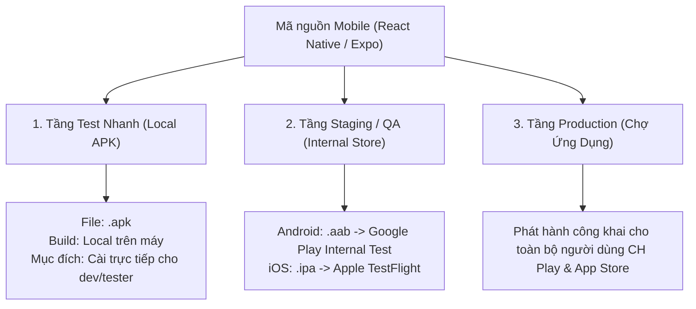

# Quy Trình Đóng Gói & Phát Hành Mobile App Chuẩn Doanh Nghiệp
> **Áp dụng cho các dự án React Native / Expo**  
> Quản trị tiêu chuẩn: `github.com/xuanhoatrieu`  
> Phiên bản: `1.0.0`

---

## MỤC LỤC
1. [Tổng Quan Kiến Trúc Phát Hành Mobile](#1-tổng-quan-kiến-trúc-phát-hành-mobile)
2. [Cấu Hình Mẫu Chuẩn Doanh Nghiệp (`eas.json`)](#2-cấu-hình-mẫu-chuẩn-doanh-nghiệp-easjson)
3. [Luồng 1: Đóng Gói APK Test Local (Cài trực tiếp điện thoại)](#3-luồng-1-đóng-gói-apk-test-local)
4. [Luồng 2: Phát Hành Lên Google Play (CH Play)](#4-luồng-2-phát-hành-lên-google-play-ch-play)
5. [Luồng 3: Phát Hành Lên Apple App Store (iOS / TestFlight)](#5-luồng-3-phát-hành-lên-apple-app-store-ios--testflight)
6. [Quy Chuẩn Quản Lý Phiên Bản (Versioning Policy)](#6-quy-chuẩn-quản-lý-phiên-bản)
7. [Bảo Mật Keystore & Khóa Ký Ứng Dụng](#7-bảo-mật-keystore--khóa-ký-ứng-dụng)
8. [Xử Lý Lỗi Thường Gặp Khi Build Local (Troubleshooting)](#8-xử-lý-lỗi-thường-gặp-khi-build-local)
9. [Bảng Tra Cứu Lệnh Nhanh (Cheat-Sheet)](#9-bảng-tra-cứu-lệnh-nhanh)

---

## 1. Tổng Quan Kiến Trúc Phát Hành Mobile

Trong các doanh nghiệp phần mềm chuyên nghiệp, quy trình phát hành ứng dụng di động được chia làm **3 chặng riêng biệt**:



* **File `.apk`**: Chỉ dùng cho **Tầng 1 (Test nội bộ)**. Không thể upload lên Google Play chính thức.
* **File `.aab` (Android App Bundle)**: Bắt buộc đối với Google Play từ năm 2021.
* **File `.ipa`**: Định dạng gói cài đặt của iOS, bắt buộc có chữ ký số của Apple.

---

## 2. Cấu Hình Mẫu Chuẩn Doanh Nghiệp (`eas.json`)

Đặt file `eas.json` tại thư mục gốc của dự án mobile:

```json
{
  "cli": {
    "version": ">= 12.0.0"
  },
  "build": {
    "development": {
      "developmentClient": true,
      "distribution": "internal"
    },
    "preview": {
      "distribution": "internal",
      "android": {
        "buildType": "apk"
      }
    },
    "production": {
      "autoIncrement": true,
      "android": {
        "buildType": "app-bundle"
      },
      "ios": {
        "simulator": false
      }
    }
  },
  "submit": {
    "production": {
      "android": {
        "serviceAccountKeyPath": "./google-service-account.json",
        "track": "internal"
      },
      "ios": {
        "appleId": "your-apple-id@email.com",
        "ascAppId": "1234567890"
      }
    }
  }
}
```

---

## 3. Luồng 1: Đóng Gói APK Test Local

### 3.1. Nguyên tắc thực thi
* **Không kiểm tra môi trường thừa**: Giả định máy/server đã cài sẵn Java JDK, Android SDK, Node.js và EAS CLI.
* **Chạy thẳng lệnh build**:

```bash
# 1. Chạy build APK local qua EAS CLI (dùng profile preview)
eas build --platform android --profile preview --local
```

### 3.2. Dự án Bare React Native (Không dùng EAS)
Nếu dự án đã prebuild hoặc dùng React Native thuần:
```bash
cd android
./gradlew clean
./gradlew assembleRelease
```
* **Đường dẫn file APK đầu ra**:  
  `android/app/build/outputs/apk/release/app-release.apk`

---

## 4. Luồng 2: Phát Hành Lên Google Play (CH Play)

Google Play bắt buộc gói **`.aab`** và yêu cầu tăng `versionCode` mỗi lần tải lên.

### Bước 1: Cấu hình `app.json`
```json
{
  "expo": {
    "name": "Tên Ứng Dụng",
    "slug": "ten-ung-dung",
    "version": "1.0.0",
    "android": {
      "package": "com.xuanhoatrieu.myapp",
      "versionCode": 1
    }
  }
}
```

### Bước 2: Build gói `.aab`
```bash
# Đóng gói bản Production
eas build --platform android --profile production
```

### Bước 3: Đẩy lên Google Play Console
1. **Lần đầu tiên**: Tải file `.aab` từ link EAS build về và upload thủ công lên Google Play Console để tạo bản phát hành đầu tiên và thiết lập chữ ký Play App Signing.
2. **Từ lần thứ hai trở đi (Tự động)**:
   ```bash
   eas submit --platform android
   ```
   *(Bản build sẽ tự động vào kênh **Internal testing (Thử nghiệm nội bộ)** để team kiểm thử trước khi bấm đẩy sang Production)*.

---

## 5. Luồng 3: Phát Hành Lên Apple App Store (iOS)

### Bước 1: Cấu hình `app.json`
```json
{
  "expo": {
    "ios": {
      "bundleIdentifier": "com.xuanhoatrieu.myapp",
      "buildNumber": "1"
    }
  }
}
```

### Bước 2: Đóng gói bản Production trên Cloud
Vì máy chủ Linux/Windows không thể build iOS cục bộ (yêu cầu macOS & Xcode), ta sử dụng EAS Cloud:
```bash
eas build --platform ios --profile production
```
*(EAS sẽ tự động tạo Certificate và Provisioning Profile nếu được liên kết với tài khoản Apple Developer)*.

### Bước 3: Đẩy lên TestFlight & App Store
```bash
eas submit --platform ios
```
* Bản build sẽ xuất hiện trên **Apple TestFlight** sau 5–10 phút xử lý.

---

## 6. Quy Chuẩn Quản Lý Phiên Bản (Versioning Policy)

Mỗi lần phát hành lên Store, bắt buộc phải cập nhật thông tin trong file `app.json`:

| Trường dữ liệu | Quy ước | Ví dụ | Mục đích |
| :--- | :--- | :--- | :--- |
| `version` | SemVer: `MAJOR.MINOR.PATCH` | `"1.2.0"` | Hiển thị cho người dùng nhìn thấy trên Store |
| `android.versionCode` | Số nguyên tăng dần | `1, 2, 3, 4...` | Google Play dùng để so sánh bản cũ và mới |
| `ios.buildNumber` | Chuỗi số nguyên tăng dần | `"1", "2", "3"...` | Apple App Store dùng để quản lý bản dựng |

> **Lưu ý:** Khi profile `production` trong `eas.json` có `autoIncrement: true`, EAS sẽ tự động tăng số bản dựng mà không cần chỉnh tay.

---

## 7. Bảo Mật Keystore & Khóa Ký Ứng Dụng

Tuyệt đối tuân thủ danh sách cấm commit vào Git trong file `.gitignore`:
```gitignore
# Android Keystore & Secret Keys
*.jks
*.keystore
google-services.json
google-service-account.json

# Apple Certificates
*.p8
*.p12
*.mobileprovision
```

Nếu mất file Keystore (hoặc để lộ lên GitHub), ứng dụng có thể bị chiếm quyền hoặc không thể cập nhật tiếp trên CH Play.

---

## 8. Xử Lý Lỗi Thường Gặp Khi Build Local (Troubleshooting)

### 1. Lỗi tràn bộ nhớ Gradle (OutOfMemoryError)
Thêm vào file `android/gradle.properties`:
```properties
org.gradle.jvmargs=-Xmx4096m -XX:MaxMetaspaceSize=1024m
```

### 2. Lỗi Gradle Cache bị hỏng
```bash
cd android && ./gradlew --stop && ./gradlew clean
```

### 3. Lỗi không tìm thấy ANDROID_HOME
Đảm bảo biến môi trường trỏ đúng Android SDK:
```bash
export ANDROID_HOME=$HOME/Android/Sdk
export PATH=$PATH:$ANDROID_HOME/emulator:$ANDROID_HOME/platform-tools
```

---

## 9. Bảng Tra Cứu Lệnh Nhanh (Cheat-Sheet)

| Yêu cầu của bạn | Lệnh Agent sẽ thực thi | File đầu ra / Đích đến |
| :--- | :--- | :--- |
| **"apk" / "build apk"** | `eas build --platform android --profile preview --local` | File `.apk` (Cài test trực tiếp) |
| **"build ch play"** | `eas build --platform android --profile production` | File `.aab` (Google App Bundle) |
| **"submit ch play"** | `eas submit --platform android` | Google Play Internal Testing Track |
| **"build app store"** | `eas build --platform ios --profile production` | File `.ipa` (Apple App Store) |
| **"submit app store"** | `eas submit --platform ios` | Apple TestFlight |
| **"build store"** | `eas build --platform all --profile production` | Cả `.aab` và `.ipa` |
